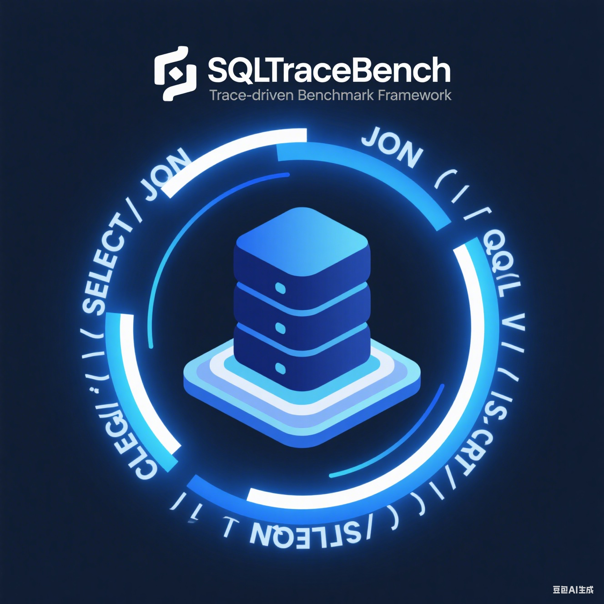

<div align="center">
  
  <h1>SQLTraceBench</h1>
  <p>
    <strong>一个通用的、用于跨数据库性能分析的 Trace 驱动基准测试框架。</strong>
  </p>
  <p>
    <!--<a href="https://github.com/turtacn/SQLTraceBench/actions/workflows/go.yml"></a>-->
    <a href="https://github.com/turtacn/SQLTraceBench/blob/main/LICENSE"></a>
    <a href="https://goreportcard.com/report/github.com/turtacn/SQLTraceBench"></a>
    <a href="https://github.com/turtacn/SQLTraceBench/releases"></a>
  </p>
  <p>
    <a href="README.md"><strong>English</strong></a> | <a href="docs/architecture.md"><strong>Architecture Doc</strong></a>
  </p>
</div>

欢迎来到 SQLTraceBench！我们的使命是彻底改变开发者和数据库管理员进行基准测试与系统对比的方式。我们的框架使您能够在不同的数据库技术之间重放真实的生产工作负载，确保您的数据库选型是基于数据，而不仅仅是宣传。

## 核心使命

SQLTraceBench 是一个 Trace 驱动的基准测试系统，其设计目标是获取已有的 SQL trace 和数据库 schema，为多种目标数据库生成等价的工作负载，并执行全面的性能对比分析。它为负载、并发和数据生成提供了灵活的控制，是数据库评估、迁移和性能调优不可或缺的工具。

## 为什么选择 SQLTraceBench？

数据库基准测试是出了名的困难。像 TPC-H/DS 这样的合成基准虽然很有价值，但通常无法反映您特定应用的独特查询模式和数据倾斜。SQLTraceBench 通过以下方式弥合了这一差距：

* **真实世界工作负载**：使用您实际的生产 SQL trace，高度精确地复现您的应用行为。
* **跨数据库转换**：智能地转换 SQL 方言和数据库 schema（例如，从 StarRocks 到 ClickHouse，或从 PostgreSQL 到 TiDB），实现真正的“同场景”公平比较。
* **可控的负载重放**：它超越了简单的重放。系统会对查询进行模板化，对数据分布进行建模，并允许您调整 QPS、并发度和热点比例，以模拟各种场景，如流量高峰或未来的业务增长。
* **可扩展的设计**：强大的插件系统使社区能够轻松地为新数据库添加支持。

## 主要功能特性

* **Schema 与 SQL 转换**：自动在不同数据库系统之间转换 DB schema 和 SQL 查询。
* **SQL 模板化与参数化**：利用 AST（抽象语法树）解析创建查询模板，并从原始 trace 中建模查询参数的分布。
* **合成数据生成**：分析源数据库中的数据分布，为目标系统生成真实且可伸缩的数据集。
* **灵活的负载生成**：对并发、QPS、查询组合和热点数据访问模式进行细粒度控制。
* **性能验证**：将被测系统性能指标（QPS、延迟、扫描行数）与原始 trace 进行对比，确保基准的保真度，并提供详细的偏差报告。
* **命令行工具**：一个功能强大且易于使用的 CLI 工具 `sql_trace_bench`，用于编排整个工作流程。

## 快速上手

### 安装

请确保您已安装 Go (版本 1.21+)。

```bash
go install [github.com/turtacn/SQLTraceBench/cmd/sql_trace_bench@latest](https://github.com/turtacn/SQLTraceBench/cmd/sql_trace_bench@latest)
````

### 基本用法

这里是一个如何运行基准测试的快速示例。假设您有一个来自 StarRocks 的 SQL trace，并希望在 ClickHouse 上测试一个等价的工作负载。

1.  **准备您的配置文件 (`config.yaml`):**

    ```yaml
    # config.yaml
    source:
      db_type: "starrocks"
      schema_file: "./schemas/starrocks_schema.yml"
      trace_file: "./traces/starrocks_trace.jsonl"
      data_source: # 用于分析数据分布的源数据库连接信息
        host: "starrocks-host"
        port: 9030
        user: "root"

    target:
      db_type: "clickhouse"
      # 用于运行基准测试的目标数据库连接信息
      host: "clickhouse-host"
      port: 9000
      user: "default"

    workload:
      concurrency: 64 # 并发工作线程数
      duration: "5m"  # 基准测试运行时间
      qps_scale: 1.5  # 以 1.5 倍原始平均 QPS 进行重放
    ```

2.  **运行基准测试:**

    ```bash
    sql_trace_bench run --config ./config.yaml
    ```

    该命令将：
    a. 解析 StarRocks 的 schema 和 trace 文件。
    
    b. 将 schema 转换为 ClickHouse 兼容的格式。
    
    c. 将 SQL 查询转换为 ClickHouse 方言。
    
    d. 基于指定的参数生成工作负载。
    
    e. 对您的 ClickHouse 实例执行基准测试并输出报告。

*(这是一个概念性示例。确切的标志和配置选项在我们的文档中有详细说明。)*

## 贡献

我们正在建立一个由热衷于数据库性能和可靠性的开发者组成的社区。我们非常欢迎各种贡献！无论是添加新的数据库插件、改进 SQL 转换逻辑，还是完善文档，您的帮助都将受到赞赏。

请阅读我们的 [贡献指南](https://www.google.com/search?q=./CONTRIBUTING.md) 以开始。

## 社区

加入我们的社区渠道，提出问题，分享您的想法，并与其他用户建立联系。

  * **GitHub Discussions**: 用于提问和讨论。
  * **Slack/Discord**: (链接待添加)

## 许可证

SQLTraceBench 采用 [Apache 2.0 许可证](https://www.google.com/search?q=./LICENSE) 授权。