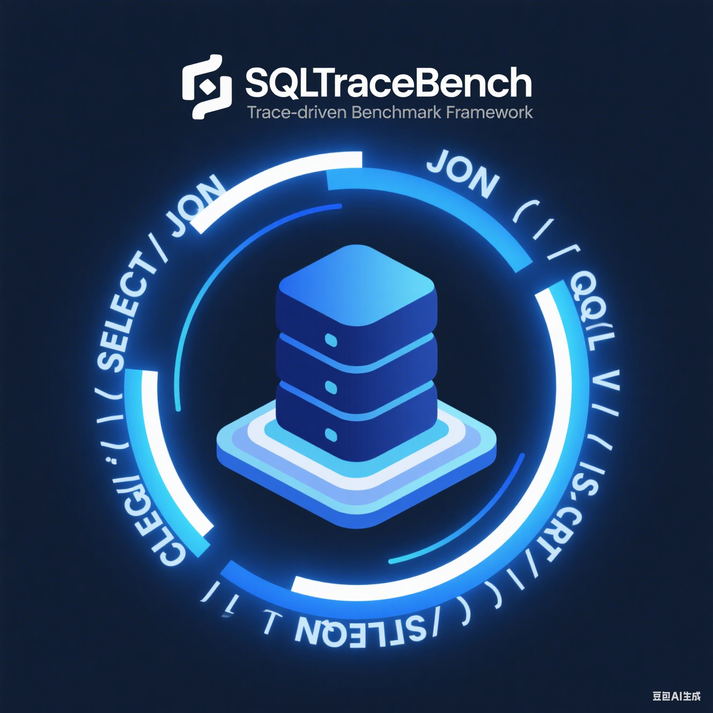
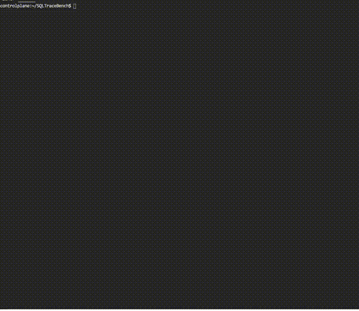

<div align="center">
  
  
  # SQLTraceBench
  
  <!--[](https://github.com/turtacn/SQLTraceBench/actions)-->
  [](https://goreportcard.com/report/github.com/turtacn/SQLTraceBench)
  [](https://opensource.org/licenses/Apache-2.0)
  [](https://godoc.org/github.com/turtacn/SQLTraceBench)
  [](https://github.com/turtacn/SQLTraceBench/releases)
  
  **强大的跨数据库性能测试与分析系统，基于真实SQL轨迹驱动**
  
  [English](README.md) | [中文](README-zh.md)
</div>

## 🎯 项目使命

SQLTraceBench 是一个创新的开源项目，能够将真实的SQL轨迹和数据库模式转换为全面的跨数据库基准测试负载。我们的使命是通过智能的轨迹分析、模式转换和负载生成，实现不同数据库系统之间的无缝性能对比和验证。



## 🔥 为什么选择 SQLTraceBench？

### 我们解决的问题

- **跨数据库迁移挑战**：组织在数据库系统间迁移时（StarRocks ↔ ClickHouse，MySQL → TiDB等）难以验证性能表现
- **缺乏真实世界基准测试**：传统的基准测试如TPC-H无法反映您实际的工作负载模式
- **性能测试中的手工工作**：在数据库间转换模式和适配查询既费时又容易出错
- **负载测试不一致**：难以生成反映生产流量的现实的参数化工作负载

### 我们的解决方案

SQLTraceBench 通过以下方式解决这些痛点：

✅ **自动化跨数据库模式转换** - 在StarRocks、ClickHouse、Doris、MySQL、PostgreSQL等之间转换模式  
✅ **智能SQL轨迹分析** - 解析真实SQL轨迹并提取有意义的模式  
✅ **基于模板的负载生成** - 将查询转换为具有真实数据分布的参数化模板  
✅ **可控负载模拟** - 调节QPS、并发数、热点比例和选择性参数  
✅ **全面验证框架** - 通过详细偏差分析对比生成的基准测试与原始轨迹

## 🚀 核心功能

### 基础能力
- **多数据库支持**：StarRocks、ClickHouse、Doris、MySQL、PostgreSQL、TiDB、OceanBase、MongoDB
- **轨迹驱动分析**：将真实SQL轨迹转换为可重现的基准测试工作负载
- **模式转换**：跨不同系统自动转换数据库模式
- **参数化引擎**：从真实轨迹中提取参数分布以生成真实数据
- **负载控制**：精细调节QPS、并发数和热点分布
- **验证与报告**：原始工作负载与合成工作负载间的全面对比

### 高级功能
- **插件架构**：可扩展框架，支持添加新的数据库支持
- **数据合成**：基于实际数据特征生成真实数据集
- **性能指标**：跟踪QPS分布、延迟百分位、行数统计和热点覆盖率
- **偏差分析**：识别并最小化真实与合成工作负载间的差异
- **集成就绪**：内置支持现有基准测试工具和框架

## 🏗️ 架构概览

SQLTraceBench 采用模块化、基于插件的架构设计，注重可扩展性和可维护性。详细技术架构请参考我们的[架构文档](docs/architecture.md)。

```mermaid
graph LR
    A[SQL轨迹 + 模式] --> B[解析引擎]
    B --> C[模板生成器]
    C --> D[参数建模器]
    D --> E[模式转换器]
    E --> F[负载生成器]
    F --> G[基准执行器]
    G --> H[验证报告器]
````

## 📦 安装

### 使用 Go Install

```bash
go install github.com/turtacn/SQLTraceBench/cmd/sql_trace_bench@latest
```

### 使用预构建二进制文件

```bash
# 从发布页面下载
curl -LO https://github.com/turtacn/SQLTraceBench/releases/latest/download/sql_trace_bench_linux_amd64.tar.gz
tar -xzf sql_trace_bench_linux_amd64.tar.gz
sudo mv sql_trace_bench /usr/local/bin/
```

### 从源码构建

```bash
git clone https://github.com/turtacn/SQLTraceBench.git
cd SQLTraceBench
make build
```

## 🎮 快速开始

要获取关于如何使用 SQLTraceBench 的完整分步指南，请参阅我们全新的 **[快速入门指南](docs/quickstart.md)**。

### 输入/输出示例

**输入模式（TPC-C示例）：**

```sql
-- examples/tpcc_schema.sql
CREATE TABLE warehouse (
  w_id INT PRIMARY KEY,
  w_name VARCHAR(10),
  w_street_1 VARCHAR(20),
  w_city VARCHAR(20),
  w_state CHAR(2),
  w_zip CHAR(9),
  w_tax DECIMAL(4,2),
  w_ytd DECIMAL(12,2)
) ENGINE=OLAP
DISTRIBUTED BY HASH(w_id);
```

**输入轨迹：**

```jsonl
{"timestamp": "2025-08-15T10:00:01Z", "query": "SELECT w_name, w_tax FROM warehouse WHERE w_id = 1", "execution_time_ms": 2.5, "rows_returned": 1}
{"timestamp": "2025-08-15T10:00:02Z", "query": "SELECT COUNT(*) FROM warehouse WHERE w_state = 'NY'", "execution_time_ms": 15.0, "rows_returned": 1}
```

**生成输出：**

```sql
-- 输出：ClickHouse模式
CREATE TABLE warehouse (
  w_id Int32,
  w_name String,
  w_street_1 String,
  w_city String,
  w_state FixedString(2),
  w_zip FixedString(9),
  w_tax Decimal(4,2),
  w_ytd Decimal(12,2)
) ENGINE = MergeTree()
ORDER BY w_id;
```

## 🎬 演示


*运行 `make demo` 生成此演示或查看 [demo/README.md](demo/README.md) 创建您自己的演示。*

## 📋 支持的数据库

| 数据库          | 模式转换 | 查询转换 | 状态  |
| ------------ | ---- | ---- | --- |
| StarRocks    | ✅    | ✅    | 稳定  |
| ClickHouse   | ✅    | ✅    | 稳定  |
| Apache Doris | ✅    | ✅    | 测试版 |
| MySQL        | ✅    | ✅    | 测试版 |
| PostgreSQL   | ✅    | ✅    | 规划中 |
| TiDB         | ✅    | ✅    | 规划中 |
| OceanBase    | 🔄   | 🔄   | 开发中 |
| MongoDB      | 🔄   | 🔄   | 规划中 |

## 🤝 参与贡献

我们欢迎社区贡献！SQLTraceBench 由开发者为开发者构建。

### 如何贡献

1. **Fork** 仓库
2. **创建** 您的功能分支 (`git checkout -b feature/amazing-feature`)
3. **提交** 您的更改 (`git commit -m 'Add some amazing feature'`)
4. **推送** 到分支 (`git push origin feature/amazing-feature`)
5. **打开** Pull Request

### 开发环境设置

```bash
# 克隆并设置开发环境
git clone https://github.com/turtacn/SQLTraceBench.git
cd SQLTraceBench
make setup-dev

# 运行测试
make test

# 运行代码检查
make lint
```

### 我们需要帮助的领域

* 🔧 **数据库插件**：添加新数据库系统的支持
* 📊 **查询分析器**：改进SQL解析和模板提取
* 🎯 **负载生成器**：增强工作负载生成策略
* 📚 **文档**：帮助我们改进文档和示例
* 🧪 **测试**：添加测试用例并改进测试覆盖率

## 📄 许可证

本项目采用 Apache License 2.0 许可证 - 详见 [LICENSE](LICENSE) 文件。

## 🙏 致谢

SQLTraceBench 构建并集成了几个优秀的开源项目：

* [StarRocks SQLTransformer](https://github.com/StarRocks/SQLTransformer) 提供SQL转换能力
* [ClickHouse TPC-DS](https://github.com/Altinity/tpc-ds) 提供基准测试方法论
* [ANTLR](https://www.antlr.org/) 提供SQL解析基础设施

## 📞 社区与支持

* 💬 **讨论**：[GitHub Discussions](https://github.com/turtacn/SQLTraceBench/discussions)
* 🐛 **问题**：[GitHub Issues](https://github.com/turtacn/SQLTraceBench/issues)
* 📧 **邮箱**：[sqltracebench@turtacn.com](mailto:sqltracebench@turtacn.com)
* 🌟 如果SQLTraceBench对您有帮助，请在GitHub上**给我们点个星**！

---

<div align="center">
  由SQLTraceBench社区用❤️制作
</div>