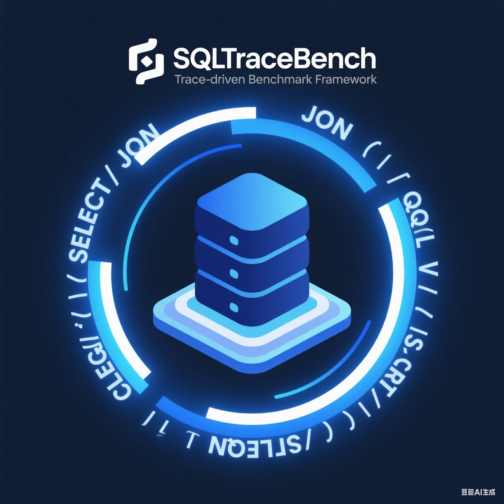
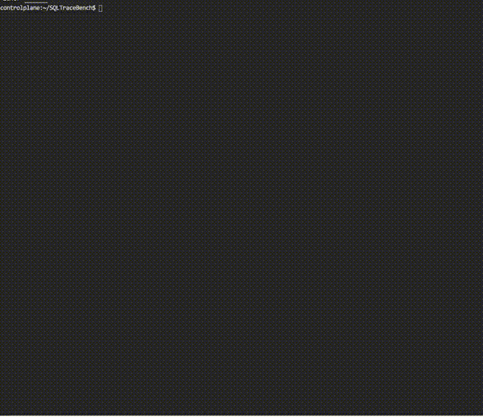

<div align="center">
  
  
  # SQLTraceBench
  
  <!--[](https://github.com/turtacn/SQLTraceBench/actions)-->
  [](https://goreportcard.com/report/github.com/turtacn/SQLTraceBench)
  [](https://opensource.org/licenses/Apache-2.0)
  [](https://godoc.org/github.com/turtacn/SQLTraceBench)
  [](https://github.com/turtacn/SQLTraceBench/releases)
  
  **A powerful trace-driven benchmark system for cross-database performance testing and analysis**
  
  [English](README.md) | [中文](README-zh.md)
</div>

## 🎯 Mission Statement

SQLTraceBench is an innovative open-source project that transforms real SQL traces and database schemas into comprehensive, cross-database benchmark workloads. Our mission is to enable seamless performance comparison and validation across different database systems through intelligent trace analysis, schema conversion, and workload generation.



## 🔥 Why SQLTraceBench?

### The Problem We Solve

- **Cross-Database Migration Challenges**: Organizations struggle to validate performance when migrating between database systems (StarRocks ↔ ClickHouse, MySQL → TiDB, etc.)
- **Lack of Real-World Benchmarks**: Traditional benchmarks like TPC-H don't reflect your actual workload patterns
- **Manual Effort in Performance Testing**: Converting schemas and adapting queries across databases is time-intensive and error-prone
- **Inconsistent Load Testing**: Difficulty in generating realistic, parameterized workloads that mirror production traffic

### Our Solution

SQLTraceBench addresses these pain points by:

✅ **Automated Cross-Database Schema Conversion** - Transform schemas between StarRocks, ClickHouse, Doris, MySQL, PostgreSQL, and more  
✅ **Intelligent SQL Trace Analysis** - Parse real SQL traces and extract meaningful patterns  
✅ **Template-Based Workload Generation** - Convert queries into parameterized templates with realistic data distributions  
✅ **Advanced Parameter Modeling** - (New in P2) Inference of parameter types, Hotspot detection, and Temporal pattern extraction.
✅ **Controllable Load Simulation** - Adjust QPS, concurrency, hotspot ratios, and selectivity parameters  
✅ **Comprehensive Validation Framework** - Compare generated benchmarks against original traces with detailed deviation analysis

## 🚀 Key Features

### Core Capabilities
- **Multi-Database Support**: StarRocks, ClickHouse, Doris, MySQL, PostgreSQL, TiDB, OceanBase, MongoDB
- **Trace-Driven Analysis**: Convert real SQL traces into reproducible benchmark workloads
- **Schema Translation**: Automated conversion of database schemas across different systems
- **Parameterization Engine**: Extract parameter distributions from real traces for realistic data generation
- **Load Control**: Fine-tune QPS, concurrency, and hotspot distribution
- **Validation & Reporting**: Comprehensive comparison between original and synthetic workloads

### Advanced Features (Phase 2)
- **Parameter Type Inference**: Automatic detection of INT, STRING, DATETIME types.
- **Hotspot Detection**: Identify and model frequently accessed data (Hotspots).
- **Temporal Pattern Extraction**: Model query arrival rates over time (e.g., daily peaks).
- **Enhanced Sampling**: Zipfian distribution with Hotspot Injection and Temporal-weighted sampling.
- **Plugin Architecture**: Extensible framework for adding new database support
- **Data Synthesis**: Generate realistic datasets based on actual data characteristics
- **Performance Metrics**: Track QPS distribution, latency percentiles, row counts, and hotspot coverage
- **Deviation Analysis**: Identify and minimize differences between real and synthetic workloads
- **Integration Ready**: Built-in support for existing benchmark tools and frameworks

## 🏗️ Architecture Overview

SQLTraceBench follows a modular, plugin-based architecture designed for extensibility and maintainability. For detailed technical architecture, see our [Architecture Documentation (English)](docs/architecture_en.md) | [中文](docs/architecture.md).

```mermaid
graph LR
    A[SQL Traces + Schema] --> B[Parser Engine]
    B --> C[Template Generator]
    C --> D[Parameter Modeler]
    D --> E[Schema Converter]
    E --> F[Workload Generator]
    F --> G[Benchmark Executor]
    G --> H[Validation Reporter]
````

## 📦 Installation

### Using Go Install

```bash
go install github.com/turtacn/SQLTraceBench/cmd/sql_trace_bench@latest
```

### Using Pre-built Binaries

```bash
# Download from releases
curl -LO https://github.com/turtacn/SQLTraceBench/releases/latest/download/sql_trace_bench_linux_amd64.tar.gz
tar -xzf sql_trace_bench_linux_amd64.tar.gz
sudo mv sql_trace_bench /usr/local/bin/
```

### Handling Large Trace Files

When dealing with large trace files (e.g., >1GB), the standard `convert` command may consume excessive memory. To avoid this, use the streaming output mode by specifying a `.jsonl` extension for the output file:

```bash
# Convert with streaming (low memory usage)
sql_trace_bench convert \
  --trace big_trace.jsonl \
  --target clickhouse \
  --out converted_traces.jsonl
```

This ensures memory usage remains low (<500MB) even for multi-gigabyte input files.

### Building from Source

```bash
git clone https://github.com/turtacn/SQLTraceBench.git
cd SQLTraceBench
make build
```

## 🎮 Quick Start

### Quick Start Guide

This guide will walk you through a complete workflow: from converting a raw SQL trace and schema to running a benchmark and validating the results.

**1. Convert Schema and Traces**

First, convert your source database's schema and SQL traces to the target database's format. In this example, we'll convert from StarRocks to ClickHouse.

```bash
sql_trace_bench convert \
  --source-db starrocks \
  --target-db clickhouse \
  --schema ./examples/tpcc_schema.sql \
  --traces ./examples/tpcc_traces.jsonl \
  --output ./output/
```

This command will create an `output` directory containing the converted schema and query templates.

**2. Generate a Workload**

Next, generate a benchmark workload from the converted templates. This will create a `workload.json` file that can be used by the execution engine.

```bash
sql_trace_bench generate \
  --template-dir ./output/templates/ \
  --param-model ./output/param_model.json \
  --qps 100 \
  --duration 1m \
  --output ./workload.json
```

**3. Run the Benchmark**

Now, run the generated workload against your target database. This will execute the queries and record performance metrics.

```bash
sql_trace_bench run \
  --workload ./workload.json \
  --target-db clickhouse \
  --qps 100 \
  --concurrency 10 \
  --output ./results.json
```

**4. Validate the Results**

Finally, validate the benchmark results against the original traces to see how closely the generated workload matches the real-world performance.

```bash
sql_trace_bench validate \
  --original-traces ./examples/tpcc_traces.jsonl \
  --benchmark-results ./results.json \
  --output ./report.html
```

This will generate an HTML report comparing the QPS and latency of the original and generated workloads.

### Advanced Generation (Phase 2)

```bash
# Enable hotspot detection and temporal modeling
sql_trace_bench generate \
  --traces production.log \
  --config configs/generation.yaml \
  --output synthetic_load.jsonl
```

### Example Input/Output

**Input Schema (TPC-C Example):**

```sql
-- examples/tpcc_schema.sql
CREATE TABLE warehouse (
  w_id INT PRIMARY KEY,
  w_name VARCHAR(10),
  w_street_1 VARCHAR(20),
  w_city VARCHAR(20),
  w_state CHAR(2),
  w_zip CHAR(9),
  w_tax DECIMAL(4,2),
  w_ytd DECIMAL(12,2)
) ENGINE=OLAP
DISTRIBUTED BY HASH(w_id);
```

**Input Trace:**

```jsonl
{"timestamp": "2025-08-15T10:00:01Z", "query": "SELECT w_name, w_tax FROM warehouse WHERE w_id = 1", "execution_time_ms": 2.5, "rows_returned": 1}
{"timestamp": "2025-08-15T10:00:02Z", "query": "SELECT COUNT(*) FROM warehouse WHERE w_state = 'NY'", "execution_time_ms": 15.0, "rows_returned": 1}
```

**Generated Output:**

```sql
-- Output: ClickHouse Schema
CREATE TABLE warehouse (
  w_id Int32,
  w_name String,
  w_street_1 String,
  w_city String,
  w_state FixedString(2),
  w_zip FixedString(9),
  w_tax Decimal(4,2),
  w_ytd Decimal(12,2)
) ENGINE = MergeTree()
ORDER BY w_id;
```

## 🎬 Demo


*Run `make demo` to generate this demonstration or see [demo/README.md](demo/README.md) for creating your own demo.*

## 📋 Supported Databases

| Database     | Schema Conversion | Query Translation | Status      |
| ------------ | ----------------- | ----------------- | ----------- |
| StarRocks    | ✅                 | ✅                 | Stable      |
| ClickHouse   | ✅                 | ✅                 | Stable      |
| Apache Doris | ✅                 | ✅                 | Beta        |
| MySQL        | ✅                 | ✅                 | Beta        |
| PostgreSQL   | ✅                 | ✅                 | Planning    |
| TiDB         | ✅                 | ✅                 | Planning    |
| OceanBase    | 🔄                | 🔄                | Development |
| MongoDB      | 🔄                | 🔄                | Planning    |

## 🤝 Contributing

We welcome contributions from the community! SQLTraceBench is built by developers, for developers.

Please read our [**Contributing Guide**](CONTRIBUTING.md) to learn how you can get involved.

### Areas We Need Help

* 🔧 **Database Plugins**: Add support for new database systems
* 📊 **Query Analyzers**: Improve SQL parsing and template extraction
* 🎯 **Load Generators**: Enhance workload generation strategies
* 📚 **Documentation**: Help us improve docs and examples
* 🧪 **Testing**: Add test cases and improve test coverage

## 📄 License

This project is licensed under the Apache License 2.0 - see the [LICENSE](LICENSE) file for details.

## 🙏 Acknowledgments

SQLTraceBench builds upon and integrates with several excellent open-source projects:

* [StarRocks SQLTransformer](https://github.com/StarRocks/SQLTransformer) for SQL translation capabilities
* [ClickHouse TPC-DS](https://github.com/Altinity/tpc-ds) for benchmark methodology
* [ANTLR](https://www.antlr.org/) for SQL parsing infrastructure

## 📞 Community & Support

* 💬 **Discussions**: [GitHub Discussions](https://github.com/turtacn/SQLTraceBench/discussions)
* 🐛 **Issues**: [GitHub Issues](https://github.com/turtacn/SQLTraceBench/issues)
* 📧 **Email**: [sqltracebench@turtacn.com](mailto:sqltracebench@turtacn.com)
* 🌟 **Star us** on GitHub if SQLTraceBench helps you!

---

<div align="center">
  Made with ❤️ by the SQLTraceBench Community
</div>
