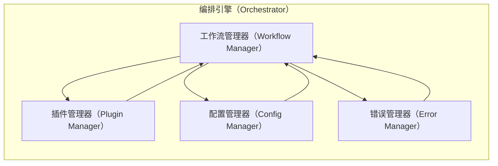
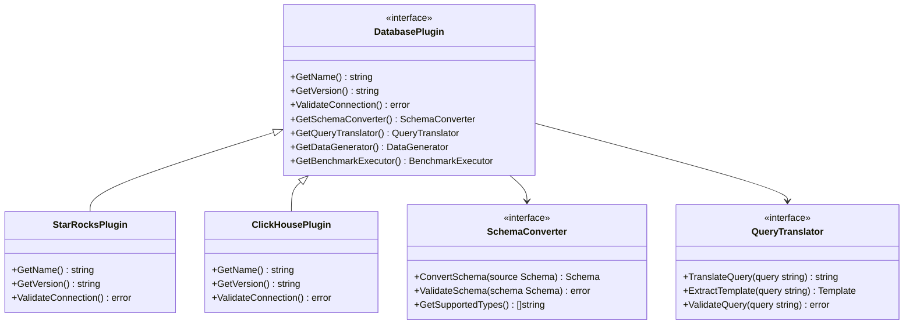
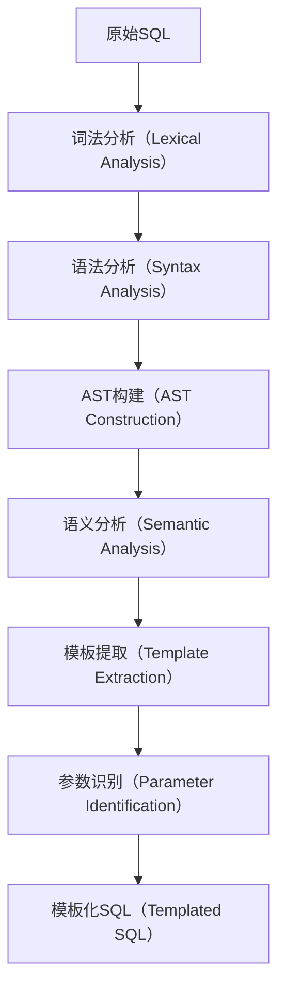
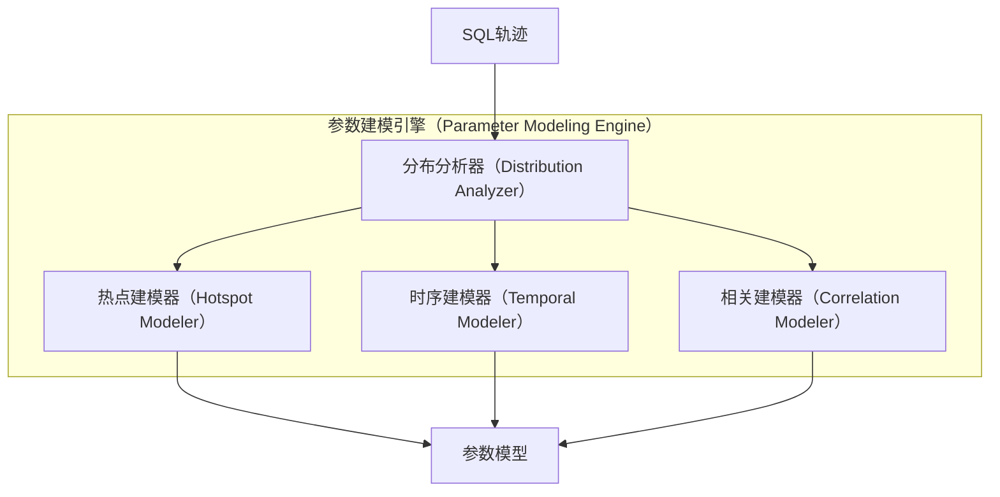

# SQLTraceBench 架构设计文档

## 概览

SQLTraceBench 是一个先进的跨数据库性能测试系统，专注于基于真实SQL轨迹的基准测试生成与验证。本文档详细阐述了系统的技术架构、核心组件设计以及实现策略，旨在为开发团队提供清晰的技术指导和架构理解。

### 领域问题全景

在现代数据密集型应用架构中，组织面临着前所未有的数据库技术选型和迁移挑战：

**技术挑战领域**：
- **跨数据库迁移复杂性**：从 StarRocks 迁移到 ClickHouse，或从 MySQL 迁移到 TiDB 时，缺乏有效的性能验证手段
- **真实负载模拟困难**：传统的 TPC-H、TPC-C 基准测试无法反映企业的实际业务查询模式
- **SQL 方言转换挑战**：不同数据库系统间的 SQL 语法差异导致手工转换错误频发
- **参数分布建模复杂**：真实业务查询中的参数分布往往具有显著的热点特征和时间周期性
- **性能基线建立困难**：缺乏标准化的跨数据库性能对比框架

**业务影响分析**：
- **决策风险**：数据库选型决策缺乏量化依据，可能导致选择不当造成的性能问题
- **迁移成本**：无法准确评估迁移后的性能表现，增加项目风险和成本
- **运维复杂性**：不同数据库系统的性能特征差异导致运维标准不统一
- **资源浪费**：缺乏精确的负载建模导致硬件资源配置不合理

### 解决方案全景

SQLTraceBench 通过构建一个智能化、自动化的跨数据库基准测试框架来系统性解决上述挑战：

**核心解决策略**：
- **轨迹驱动方法论**：基于真实生产环境的 SQL 轨迹进行分析和建模
- **智能模式转换**：自动化的跨数据库 Schema 和 SQL 转换引擎
- **参数化建模**：高保真的参数分布建模和数据合成
- **可控负载生成**：支持多维度调节的基准测试负载生成
- **全面验证框架**：端到端的性能验证和偏差分析

### 预期效果与展望

**短期目标**（MVP 阶段）：
- 支持 StarRocks ↔ ClickHouse 的完整转换流程
- 实现基本的 SQL 模板化和参数提取
- 提供可调节的负载生成和执行能力
- 建立验证框架的基础版本

**中期目标**（生产就绪）：
- 扩展支持 MySQL、PostgreSQL、TiDB、Doris 等主流数据库
- 完善参数分布建模，支持复杂的热点和时序特征
- 集成现有基准测试工具和框架
- 提供企业级的报告和分析功能

**长期愿景**（生态构建）：
- 建立开源社区驱动的数据库适配器生态
- 提供云原生的基准测试服务
- 支持实时性能监控和预警
- 构建数据库性能知识库和最佳实践

## 系统架构

### 整体架构概览

SQLTraceBench 采用分层的模块化架构，遵循领域驱动设计（DDD）原则，确保系统的可扩展性、可维护性和可测试性。

```mermaid
graph TD
    %% 系统分层架构图
    subgraph UI[用户接口层（Interface Layer）]
        CLI[命令行接口（CLI Interface）]
        API[HTTP API接口（HTTP API）]
    end
    
    subgraph APP[应用服务层（Application Layer）]
        CS[转换服务（Conversion Service）]
        GS[生成服务（Generation Service）]
        ES[执行服务（Execution Service）]
        VS[验证服务（Validation Service）]
    end
    
    subgraph DOMAIN[领域层（Domain Layer）]
        TE[模板引擎（Template Engine）]
        PM[参数建模器（Parameter Modeler）]
        SC[模式转换器（Schema Converter）]
        WG[负载生成器（Workload Generator）]
    end
    
    subgraph INFRA[基础设施层（Infrastructure Layer）]
        DB[数据库连接器（Database Connectors）]
        PARSER[SQL解析器（SQL Parsers）]
        STORE[存储适配器（Storage Adapters）]
        LOG[日志系统（Logging System）]
    end
    
    CLI --> CS
    CLI --> GS
    CLI --> ES
    CLI --> VS
    API --> CS
    API --> GS
    API --> ES
    API --> VS
    
    CS --> TE
    CS --> SC
    GS --> PM
    GS --> WG
    ES --> WG
    VS --> PM
    
    TE --> PARSER
    PM --> STORE
    SC --> PARSER
    WG --> DB
    
    PARSER --> LOG
    DB --> LOG
    STORE --> LOG
````

### 核心数据流

系统的核心处理流程遵循轨迹驱动的基准测试生成模式：

```mermaid
sequenceDiagram
    participant U as 用户（User）
    participant CLI as CLI接口
    participant CS as 转换服务
    participant TE as 模板引擎
    participant SC as 模式转换器
    participant PM as 参数建模器
    participant WG as 负载生成器
    participant ES as 执行服务
    participant VS as 验证服务
    
    U->>CLI: 提交转换请求
    CLI->>CS: 调用转换服务
    CS->>TE: 解析SQL轨迹
    TE-->>CS: 返回SQL模板
    CS->>SC: 转换数据库模式
    SC-->>CS: 返回目标模式
    CS->>PM: 建立参数模型
    PM-->>CS: 返回参数分布
    CS-->>CLI: 转换完成
    CLI-->>U: 显示转换结果
    
    U->>CLI: 启动负载生成
    CLI->>WG: 调用负载生成器
    WG->>PM: 获取参数分布
    PM-->>WG: 返回参数样本
    WG-->>CLI: 生成基准负载
    CLI-->>U: 负载生成完成
    
    U->>CLI: 执行基准测试
    CLI->>ES: 调用执行服务
    ES->>WG: 获取测试负载
    WG-->>ES: 返回执行计划
    ES-->>CLI: 执行结果
    CLI->>VS: 启动验证
    VS-->>CLI: 验证报告
    CLI-->>U: 显示完整结果
```

## 核心组件设计

### CLI 引擎（基于 Cobra）

CLI 引擎负责处理用户交互，提供直观的命令行接口。

**设计特点**：

* 基于 Cobra 框架构建，提供丰富的命令和参数支持
* 支持交互式和批处理两种执行模式
* 内置进度显示和错误处理机制
* 提供详细的帮助文档和使用示例

**核心命令结构**：

```
sql_trace_bench
├── convert    # 转换命令：schema + traces → 目标格式
├── generate   # 生成命令：templates + models → workload
├── run        # 执行命令：workload → results
├── validate   # 验证命令：original vs synthetic → report
└── plugin     # 插件管理：install/list/remove plugins
```

### 编排引擎（Orchestrator）

编排引擎是系统的核心控制器，负责协调各个组件的工作流程。

**职责范围**：

* 解析输入参数和配置文件
* 加载合适的数据库插件
* 管理整个处理工作流
* 处理错误和异常情况
* 提供进度反馈和状态监控



### 插件接口架构

插件系统采用接口驱动的设计，支持不同数据库系统的动态扩展。

**核心接口定义**：

* `DatabasePlugin`：数据库特定功能的统一接口
* `SchemaConverter`：模式转换接口
* `QueryTranslator`：查询转换接口
* `DataGenerator`：数据生成接口
* `BenchmarkExecutor`：基准测试执行接口



### SQL 解析引擎

SQL 解析引擎负责解析、分析和转换 SQL 语句。

**技术选型**：

* 主要解析器：基于 ANTLR4 的 SQL 语法解析器
* 备用解析器：golang 原生 SQL 解析库（如 vitess/sqlparser）
* AST 处理：自定义的抽象语法树处理框架

**处理流程**：



### 模式转换引擎

模式转换引擎处理不同数据库系统间的 Schema 转换。

**转换策略**：

* **类型映射表**：维护数据类型的映射关系
* **约束转换**：处理主键、外键、索引等约束
* **分区策略**：转换分区和分布策略
* **性能优化**：添加目标数据库的性能优化建议

**转换矩阵示例**：

| 源数据库       | 目标数据库      | VARCHAR | BIGINT | DECIMAL   | 分区策略                        |
| ---------- | ---------- | ------- | ------ | --------- | --------------------------- |
| StarRocks  | ClickHouse | String  | Int64  | Decimal64 | PARTITION BY → PARTITION BY |
| MySQL      | StarRocks  | VARCHAR | BIGINT | DECIMAL   | 无 → DISTRIBUTED BY HASH     |
| PostgreSQL | ClickHouse | String  | Int64  | Decimal64 | 无 → ORDER BY                |

### 参数建模引擎

参数建模引擎分析 SQL 轨迹中的参数分布，建立统计模型。

**建模算法**：

* **离散分布**：Zipfian 分布拟合热点参数
* **连续分布**：正态分布、对数正态分布拟合数值参数
* **时间序列**：周期性和趋势分析拟合时间参数
* **相关性分析**：参数间的相关关系建模



### 负载生成引擎

负载生成引擎根据模板和参数模型生成可执行的基准测试负载。

**生成策略**：

* **QPS 控制**：支持固定 QPS 和泊松分布 QPS
* **并发控制**：动态调节并发连接数
* **热点模拟**：按比例生成热点和冷点数据
* **时序模拟**：模拟真实的时间分布特征

### 验证分析引擎

验证分析引擎对比原始轨迹与生成的基准测试结果。

**验证维度**：

* **QPS 分布对比**：时间维度的 QPS 分布相似性
* **延迟分布对比**：P50、P95、P99 延迟分布对比
* **结果集对比**：返回行数、扫描行数的分布对比
* **热点覆盖对比**：热点表、热点字段的覆盖率对比

## 技术实现细节

### 代码结构设计


```
SQLTraceBench/
├── cmd/                           # 命令行入口
│   └── sql_trace_bench/
│       └── main.go
├── internal/                      # 内部包，不对外暴露
│   ├── app/                      # 应用服务层
│   │   ├── conversion/           # 转换服务
│   │   ├── generation/           # 生成服务
│   │   ├── execution/            # 执行服务
│   │   └── validation/           # 验证服务
│   ├── domain/                   # 领域层
│   │   ├── models/               # 领域模型
│   │   ├── services/             # 领域服务
│   │   └── repositories/         # 仓储接口
│   ├── infrastructure/           # 基础设施层
│   │   ├── database/             # 数据库连接器
│   │   ├── parsers/              # SQL解析器
│   │   ├── storage/              # 存储适配器
│   │   └── logging/              # 日志系统
│   └── interfaces/               # 接口层
│       ├── cli/                  # CLI接口
│       ├── http/                 # HTTP接口
│       └── grpc/                 # gRPC接口（未来扩展）
├── pkg/                          # 对外暴露的公共包
│   ├── plugins/                  # 插件接口定义
│   ├── types/                    # 公共类型定义
│   └── utils/                    # 工具函数
├── plugins/                      # 数据库插件实现
│   ├── starrocks/               # StarRocks插件
│   ├── clickhouse/              # ClickHouse插件
│   ├── mysql/                   # MySQL插件
│   └── postgresql/              # PostgreSQL插件
├── configs/                      # 配置文件
├── examples/                     # 示例文件
├── docs/                        # 文档
├── scripts/                     # 构建和部署脚本
├── test/                        # 集成测试
└── Makefile                     # 构建配置
```

### 核心数据结构设计

**SQL 轨迹格式**：

```go
type SQLTrace struct {
    Timestamp       time.Time     `json:"timestamp"`
    Query           string        `json:"query"`
    ExecutionTimeMs float64       `json:"execution_time_ms"`
    RowsReturned    int64         `json:"rows_returned"`
    RowsScanned     int64         `json:"rows_scanned,omitempty"`
    DatabaseName    string        `json:"database_name,omitempty"`
    UserName        string        `json:"user_name,omitempty"`
    ClientIP        string        `json:"client_ip,omitempty"`
    QueryHash       string        `json:"query_hash,omitempty"`
}
```

**SQL 模板格式**：

```go
type SQLTemplate struct {
    ID              string            `json:"id"`
    OriginalQuery   string            `json:"original_query"`
    TemplateQuery   string            `json:"template_query"`
    Parameters      []Parameter       `json:"parameters"`
    QueryType       QueryType         `json:"query_type"`
    Tables          []string          `json:"tables"`
    Frequency       int               `json:"frequency"`
    CreatedAt       time.Time         `json:"created_at"`
}

type Parameter struct {
    Name            string            `json:"name"`
    Type            ParameterType     `json:"type"`
    Position        int               `json:"position"`
    Distribution    Distribution      `json:"distribution"`
}
```

**参数分布模型**：

```go
type ParameterModel struct {
    Templates       map[string]SQLTemplate    `json:"templates"`
    Parameters      map[string]ParamStats     `json:"parameters"`
    GlobalStats     GlobalStatistics          `json:"global_stats"`
    GeneratedAt     time.Time                 `json:"generated_at"`
}

type ParamStats struct {
    Type            ParameterType             `json:"type"`
    Distribution    DistributionType          `json:"distribution"`
    Values          []interface{}             `json:"values"`
    Frequencies     []int                     `json:"frequencies"`
    HotspotRatio    float64                   `json:"hotspot_ratio"`
    Statistics      map[string]float64        `json:"statistics"`
}
```

### 错误处理策略

采用分层的错误处理机制，确保错误信息的清晰性和可追溯性：

```go
type SQLTraceBenchError struct {
    Code        ErrorCode       `json:"code"`
    Message     string          `json:"message"`
    Details     string          `json:"details"`
    Component   string          `json:"component"`
    Timestamp   time.Time       `json:"timestamp"`
    Cause       error           `json:"cause,omitempty"`
}

type ErrorCode int

const (
    ErrUnknown ErrorCode = iota
    ErrInvalidInput
    ErrParsingFailed
    ErrConversionFailed
    ErrDatabaseConnection
    ErrPluginNotFound
    ErrValidationFailed
)
```

### 日志系统设计

采用结构化日志，支持不同级别的日志输出和多种输出格式：

```go
type Logger interface {
    Debug(msg string, fields ...Field)
    Info(msg string, fields ...Field)
    Warn(msg string, fields ...Field)
    Error(msg string, fields ...Field)
    Fatal(msg string, fields ...Field)
}

type Field struct {
    Key   string
    Value interface{}
}
```

## 性能与可扩展性设计

### 性能优化策略

**内存管理**：

* 流式处理大型 SQL 轨迹文件
* 对象池复用减少内存分配
* 增量式参数分布更新

**并发处理**：

* SQL 解析任务的并行化处理
* 数据库连接池管理
* 负载生成的并发控制

**缓存机制**：

* SQL 解析结果缓存
* 模式转换结果缓存
* 参数分布模型缓存

### 可扩展性设计

**水平扩展**：

* 支持分布式基准测试执行
* 负载均衡的查询分发
* 结果聚合和汇总机制

**垂直扩展**：

* 插件系统的动态加载
* 自定义解析器的注册机制
* 可配置的性能参数调优

## 安全性考虑

### 数据安全

**敏感信息保护**：

* SQL 轨迹中敏感数据的脱敏处理
* 数据库连接信息的加密存储
* 日志文件中敏感信息的过滤

**访问控制**：

* 基于角色的权限管理
* API 接口的认证和授权
* 数据库连接的最小权限原则

### 代码安全

**输入验证**：

* SQL 注入攻击防护
* 参数类型和范围验证
* 文件路径遍历防护

**依赖管理**：

* 定期更新第三方依赖
* 漏洞扫描和安全审计
* 最小化依赖原则

## 测试策略

### 测试层次

**单元测试**：

* 核心算法逻辑测试
* 数据结构操作测试
* 错误处理路径测试

**集成测试**：

* 数据库插件集成测试
* 端到端工作流测试
* 性能基准测试

**系统测试**：

* 大规模数据处理测试
* 长时间稳定性测试
* 多数据库兼容性测试

### 测试数据

**标准数据集**：

* TPC-C 基准数据集
* TPC-H 决策支持数据集
* 自定义业务场景数据集

**合成数据**：

* 参数化的 SQL 轨迹生成
* 多样化的数据分布模拟
* 异常场景的边界测试

## 部署与运维

### 部署方式

**二进制部署**：

* 单一可执行文件分发
* 跨平台兼容性支持
* 最小化运行时依赖

**容器化部署**：

* Docker 镜像构建
* Kubernetes 部署配置
* 服务网格集成支持

### 监控指标

**系统指标**：

* CPU 使用率和内存占用
* 磁盘 I/O 和网络流量
* 错误率和响应时间

**业务指标**：

* 转换成功率和处理速度
* 基准测试执行效率
* 验证偏差和准确性

## 发展路线图

### 第一阶段

* [ ] 完成核心架构和基础框架
* [ ] 实现 StarRocks ↔ ClickHouse 转换
* [ ] 基本的 CLI 接口和命令支持
* [ ] 简单的 SQL 模板化和参数提取
* [ ] 基础的验证和报告功能

### 第二阶段

* [ ] 扩展更多数据库支持（MySQL、PostgreSQL、Doris）
* [ ] 完善参数分布建模算法
* [ ] 添加数据合成和热点模拟功能
* [ ] 实现插件系统和动态加载
* [ ] 增强错误处理和日志系统

### 第三阶段

* [ ] 性能优化和并发处理改进
* [ ] 完整的集成测试和文档
* [ ] 企业级的安全和监控功能
* [ ] HTTP API 接口和 Web UI
* [ ] 云原生部署和扩展支持

### 第四阶段

* [ ] 开源社区生态建设
* [ ] 第三方插件开发SDK
* [ ] 性能知识库和最佳实践
* [ ] SaaS 服务和商业化探索
* [ ] 人工智能辅助的查询优化

## 参考资料

\[1] StarRocks SQLTransformer - [https://github.com/StarRocks/SQLTransformer](https://github.com/StarRocks/SQLTransformer)

\[2] ClickHouse TPC-DS Benchmark - [https://github.com/Altinity/tpc-ds](https://github.com/Altinity/tpc-ds)

\[3] TPC-H Decision Support Benchmark - [https://www.tpc.org/tpch/](https://www.tpc.org/tpch/)

\[4] ClickHouse Database System - [https://github.com/ClickHouse/ClickHouse](https://github.com/ClickHouse/ClickHouse)

\[5] StarRocks Analytics Database - [https://github.com/StarRocks/starrocks](https://github.com/StarRocks/starrocks)

\[6] ANTLR Parser Generator - [https://www.antlr.org/](https://www.antlr.org/)

\[7] Go Database/SQL Package - [https://pkg.go.dev/database/sql](https://pkg.go.dev/database/sql)

\[8] Cobra CLI Library - [https://github.com/spf13/cobra](https://github.com/spf13/cobra)

\[9] Domain-Driven Design Principles - [https://domainlanguage.com/ddd/](https://domainlanguage.com/ddd/)

\[10] Clean Architecture Patterns - [https://blog.cleancoder.com/uncle-bob/2012/08/13/the-clean-architecture.html](https://blog.cleancoder.com/uncle-bob/2012/08/13/the-clean-architecture.html)