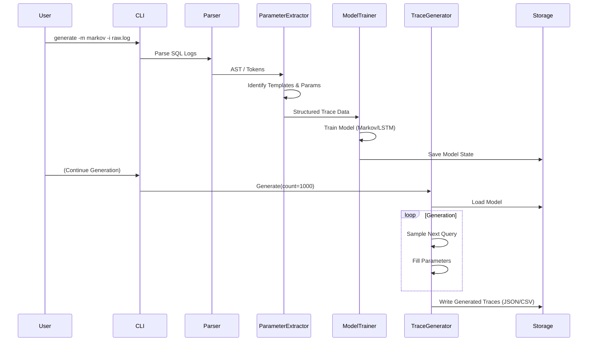
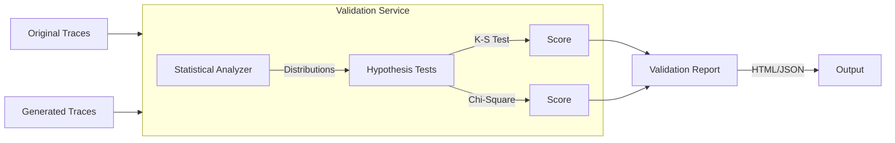
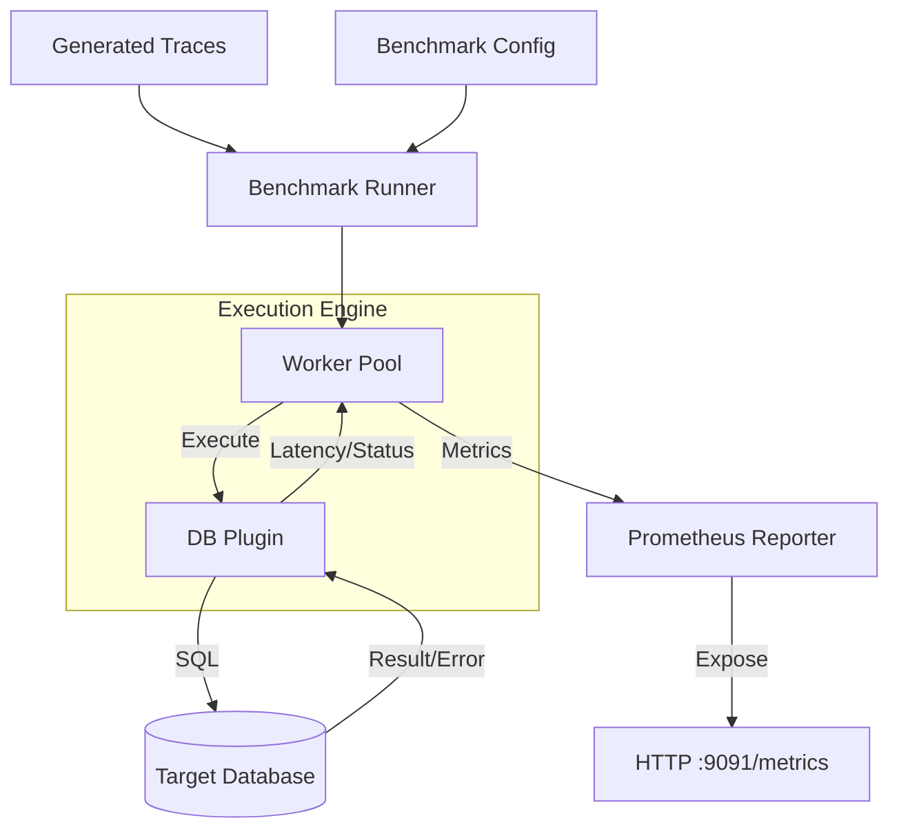

# Data Flow Architecture

This document describes the flow of data through the SQL Trace Bench system, covering the three main pipelines: Learning & Generation, Validation, and Benchmarking.

## 1. Learning & Generation Pipeline

This pipeline transforms raw SQL logs into a statistical model and then synthesizes new trace workloads.

### Data Structures
*   **Raw Log**: Plain text SQL queries.
*   **Trace**: Structured object with `Timestamp`, `QueryTemplate`, `Parameters`, `Duration`.
*   **Model Artifact**: Serialized probability matrices (Markov) or weights (LSTM).

## 2. Validation Pipeline

This pipeline compares the statistical properties of the generated traces against the original workload to ensure fidelity.

### Key Metrics
*   **Query Type Distribution**: Frequency of SELECT, INSERT, UPDATE, DELETE.
*   **Parameter Distribution**: Value distributions for extracted parameters.
*   **Temporal Patterns**: Arrival rate and inter-arrival times.
*   **Validation Score**: A composite score (0.0 - 1.0) indicating similarity.

## 3. Benchmarking Pipeline

This pipeline executes the generated traces against a target database to measure performance.

### Metric Flow
1.  **Latency Recording**: Each execution measures start and end time.
2.  **Aggregation**: Metrics are aggregated by Query Template ID.
3.  **Export**: Prometheus scrapes the metrics endpoint.
4.  **Visualization**: Grafana dashboards query Prometheus to display QPS, P99, Error Rate.
