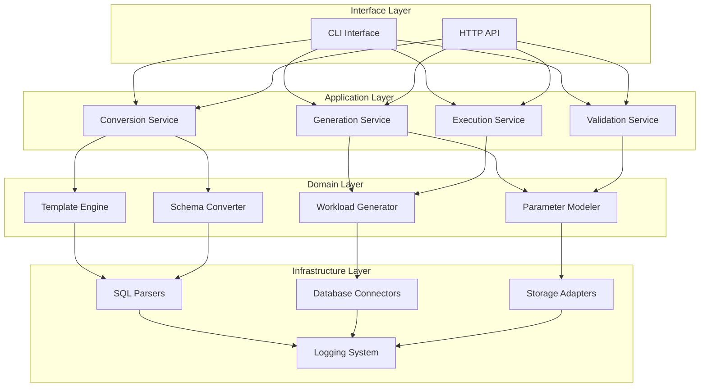
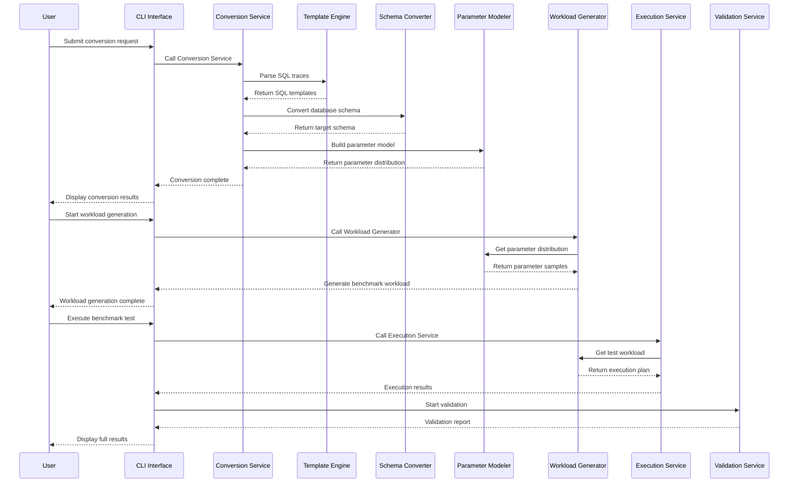
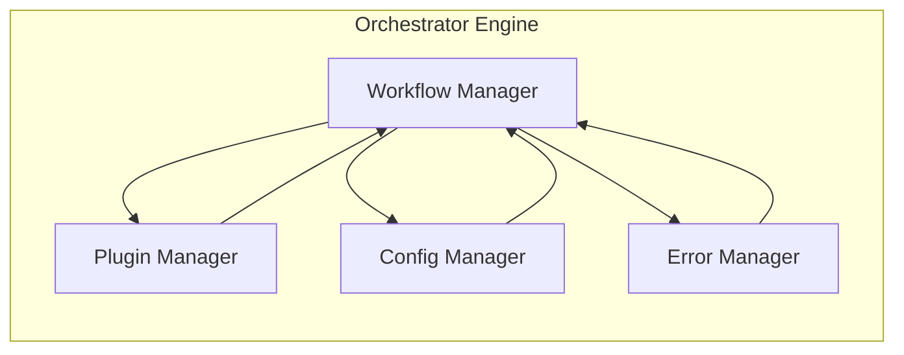
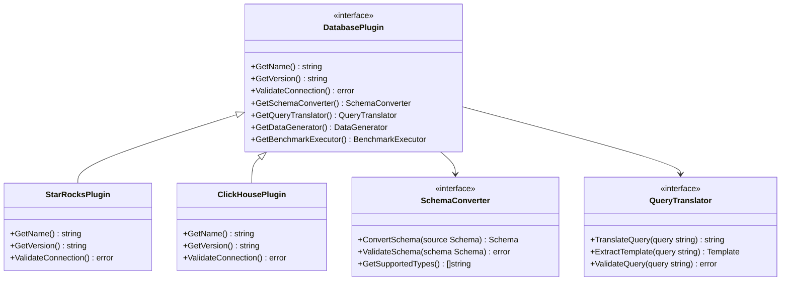
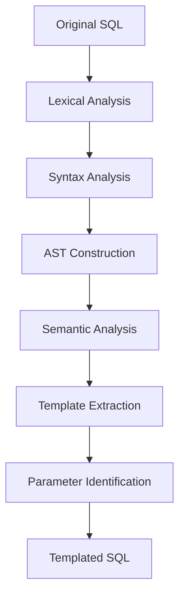
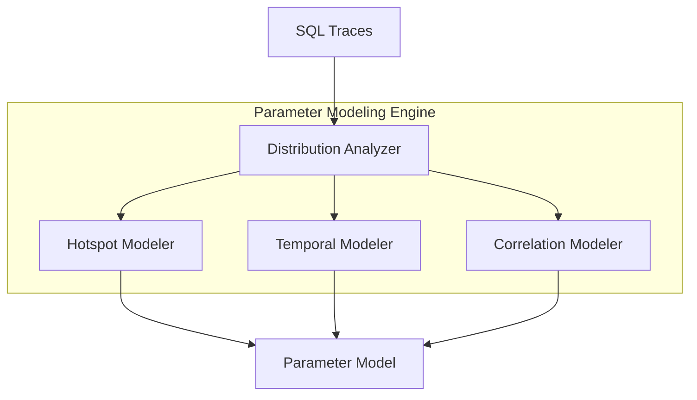

# SQLTraceBench Architecture Design Document

## Overview

SQLTraceBench is an advanced cross-database performance testing system focused on generating and validating benchmarks based on real SQL traces. This document details the system's technical architecture, core component design, and implementation strategies, aiming to provide the development team with clear technical guidance and architectural understanding.

### Domain Problem Landscape

In modern data-intensive application architectures, organizations face unprecedented challenges in database technology selection and migration:

**Technical Challenges:**
- **Cross-Database Migration Complexity**: Lack of effective performance validation methods when migrating from StarRocks to ClickHouse, or from MySQL to TiDB.
- **Difficulty in Simulating Real Workloads**: Traditional benchmarks like TPC-H and TPC-C cannot reflect the actual business query patterns of an enterprise.
- **SQL Dialect Conversion Challenges**: Syntactic differences between database systems lead to frequent manual conversion errors.
- **Complex Parameter Distribution Modeling**: The parameter distributions in real business queries often have significant hotspot characteristics and time-periodicity.
- **Difficulty in Establishing Performance Baselines**: Lack of a standardized framework for cross-database performance comparison.

**Business Impact Analysis:**
- **Decision Risk**: Database selection decisions lack quantitative evidence, potentially leading to performance issues from poor choices.
- **Migration Costs**: Inability to accurately assess post-migration performance increases project risks and costs.
- **Operational Complexity**: Performance characteristic differences between database systems lead to inconsistent operational standards.
- **Resource Waste**: Lack of precise workload modeling leads to unreasonable hardware resource allocation.

### Solution Landscape

SQLTraceBench systematically addresses the above challenges by building an intelligent, automated cross-database benchmark testing framework:

**Core Solution Strategies:**
- **Trace-Driven Methodology**: Analysis and modeling based on SQL traces from real production environments.
- **Intelligent Schema and SQL Conversion**: Automated cross-database Schema and SQL conversion engine.
- **Parametric Modeling**: High-fidelity parameter distribution modeling and data synthesis.
- **Controllable Workload Generation**: Benchmark workload generation with multi-dimensional adjustments.
- **Comprehensive Validation Framework**: End-to-end performance validation and deviation analysis.

### Expected Effects and Outlook

**Short-Term Goals (MVP Phase):**
- Support the complete conversion process for StarRocks ↔ ClickHouse.
- Implement basic SQL templating and parameter extraction.
- Provide adjustable workload generation and execution capabilities.
- Establish a basic version of the validation framework.

**Mid-Term Goals (Production Ready):**
- Expand support to mainstream databases like MySQL, PostgreSQL, TiDB, Doris, etc.
- Improve parameter distribution modeling to support complex hotspot and time-series features.
- Integrate with existing benchmark tools and frameworks.
- Provide enterprise-level reporting and analysis functions.

**Long-Term Vision (Ecosystem Building):**
- Establish an open-source, community-driven ecosystem of database adapters.
- Provide cloud-native benchmark testing services.
- Support real-time performance monitoring and alerting.
- Build a database performance knowledge base and best practices.

## System Architecture

### Overall Architecture Overview

SQLTraceBench adopts a layered, modular architecture that follows Domain-Driven Design (DDD) principles to ensure system scalability, maintainability, and testability.



### Core Data Flow

The system's core processing flow follows a trace-driven benchmark generation model:



## Core Component Design

### CLI Engine (Based on Cobra)

The CLI engine handles user interaction and provides an intuitive command-line interface.

**Design Features:**
- Built on the Cobra framework, providing rich command and parameter support.
- Supports both interactive and batch execution modes.
- Built-in progress display and error handling mechanisms.
- Provides detailed help documentation and usage examples.

**Core Command Structure:**
```
sql_trace_bench
├── convert    # Convert command: schema + traces → target format
├── generate   # Generate command: templates + models → workload
├── run        # Execute command: workload → results
├── validate   # Validate command: original vs synthetic → report
└── plugin     # Plugin management: install/list/remove plugins
```

### Orchestrator Engine

The orchestrator is the system's core controller, responsible for coordinating the workflow of various components.

**Responsibilities:**
- Parse input parameters and configuration files.
- Load appropriate database plugins.
- Manage the entire processing workflow.
- Handle errors and exceptions.
- Provide progress feedback and status monitoring.



### Plugin Interface Architecture

The plugin system uses an interface-driven design, supporting dynamic extension for different database systems.

**Core Interface Definitions:**
- `DatabasePlugin`: A unified interface for database-specific functionalities.
- `SchemaConverter`: Interface for schema conversion.
- `QueryTranslator`: Interface for query translation.
- `DataGenerator`: Interface for data generation.
- `BenchmarkExecutor`: Interface for benchmark execution.



### SQL Parsing Engine

The SQL parsing engine is responsible for parsing, analyzing, and transforming SQL statements.

**Technology Choices:**
- Primary Parser: SQL grammar parser based on ANTLR4.
- Fallback Parser: Native Go SQL parsing library (e.g., vitess/sqlparser).
- AST Handling: Custom abstract syntax tree processing framework.

**Processing Flow:**


### Schema Conversion Engine

The schema conversion engine handles schema transformations between different database systems.

**Conversion Strategies:**
- **Type Mapping Tables**: Maintain mapping relationships for data types.
- **Constraint Conversion**: Handle primary keys, foreign keys, indexes, etc.
- **Partitioning Strategy**: Convert partitioning and distribution strategies.
- **Performance Optimization**: Add performance optimization suggestions for the target database.

**Example Conversion Matrix:**

| Source DB  | Target DB  | VARCHAR | BIGINT | DECIMAL   | Partitioning Strategy       |
|------------|------------|---------|--------|-----------|-----------------------------|
| StarRocks  | ClickHouse | String  | Int64  | Decimal64 | PARTITION BY → PARTITION BY |
| MySQL      | StarRocks  | VARCHAR | BIGINT | DECIMAL   | None → DISTRIBUTED BY HASH  |
| PostgreSQL | ClickHouse | String  | Int64  | Decimal64 | None → ORDER BY             |

### Parameter Modeling Engine

The parameter modeling engine analyzes parameter distributions in SQL traces to build statistical models.

**Modeling Algorithms:**
- **Discrete Distribution**: Zipfian distribution to fit hotspot parameters.
- **Continuous Distribution**: Normal, log-normal distributions to fit numerical parameters.
- **Time Series**: Periodicity and trend analysis for time-based parameters.
- **Correlation Analysis**: Modeling correlations between parameters.



### Workload Generation Engine

The workload generation engine produces executable benchmark workloads based on templates and parameter models.

**Generation Strategies:**
- **QPS Control**: Supports fixed QPS and Poisson distribution QPS.
- **Concurrency Control**: Dynamically adjust concurrent connections.
- **Hotspot Simulation**: Generate hotspot and coldspot data proportionally.
- **Temporal Simulation**: Simulate real-world time distribution features.

### Validation and Analysis Engine

The validation engine compares the original traces with the generated benchmark results.

**Validation Dimensions:**
- **QPS Distribution Comparison**: Similarity of QPS distribution over time.
- **Latency Distribution Comparison**: P50, P95, P99 latency distribution comparison.
- **Result Set Comparison**: Distribution comparison of rows returned and rows scanned.
- **Hotspot Coverage Comparison**: Coverage of hotspot tables and fields.

## Technical Implementation Details

### Code Structure Design

```
SQLTraceBench/
├── cmd/                           # Command-line entry points
│   └── sql_trace_bench/
│       └── main.go
├── internal/                      # Internal packages, not exposed externally
│   ├── app/                      # Application layer
│   │   ├── conversion/           # Conversion service
│   │   ├── generation/           # Generation service
│   │   ├── execution/            # Execution service
│   │   └── validation/           # Validation service
│   ├── domain/                   # Domain layer
│   │   ├── models/               # Domain models
│   │   ├── services/             # Domain services
│   │   └── repositories/         # Repository interfaces
│   ├── infrastructure/           # Infrastructure layer
│   │   ├── database/             # Database connectors
│   │   ├── parsers/              # SQL parsers
│   │   ├── storage/              # Storage adapters
│   │   └── logging/              # Logging system
│   └── interfaces/               # Interface layer
│       ├── cli/                  # CLI interface
│       ├── http/                 # HTTP interface
│       └── grpc/                 # gRPC interface (future extension)
├── pkg/                          # Publicly exposed packages
│   ├── plugins/                  # Plugin interface definitions
│   ├── types/                    # Common type definitions
│   └── utils/                    # Utility functions
├── plugins/                      # Database plugin implementations
│   ├── starrocks/               # StarRocks plugin
│   ├── clickhouse/              # ClickHouse plugin
│   ├── mysql/                   # MySQL plugin
│   └── postgresql/              # PostgreSQL plugin
├── configs/                      # Configuration files
├── examples/                     # Example files
├── docs/                        # Documentation
├── scripts/                     # Build and deployment scripts
├── test/                        # Integration tests
└── Makefile                     # Build configuration
```

### Core Data Structure Design

**SQL Trace Format:**
```go
type SQLTrace struct {
    Timestamp       time.Time     `json:"timestamp"`
    Query           string        `json:"query"`
    ExecutionTimeMs float64       `json:"execution_time_ms"`
    RowsReturned    int64         `json:"rows_returned"`
    RowsScanned     int64         `json:"rows_scanned,omitempty"`
    DatabaseName    string        `json:"database_name,omitempty"`
    UserName        string        `json:"user_name,omitempty"`
    ClientIP        string        `json:"client_ip,omitempty"`
    QueryHash       string        `json:"query_hash,omitempty"`
}
```

**SQL Template Format:**
```go
type SQLTemplate struct {
    ID              string            `json:"id"`
    OriginalQuery   string            `json:"original_query"`
    TemplateQuery   string            `json:"template_query"`
    Parameters      []Parameter       `json:"parameters"`
    QueryType       QueryType         `json:"query_type"`
    Tables          []string          `json:"tables"`
    Frequency       int               `json:"frequency"`
    CreatedAt       time.Time         `json:"created_at"`
}

type Parameter struct {
    Name            string            `json:"name"`
    Type            ParameterType     `json:"type"`
    Position        int               `json:"position"`
    Distribution    Distribution      `json:"distribution"`
}
```

**Parameter Distribution Model:**
```go
type ParameterModel struct {
    Templates       map[string]SQLTemplate    `json:"templates"`
    Parameters      map[string]ParamStats     `json:"parameters"`
    GlobalStats     GlobalStatistics          `json:"global_stats"`
    GeneratedAt     time.Time                 `json:"generated_at"`
}

type ParamStats struct {
    Type            ParameterType             `json:"type"`
    Distribution    DistributionType          `json:"distribution"`
    Values          []interface{}             `json:"values"`
    Frequencies     []int                     `json:"frequencies"`
    HotspotRatio    float64                   `json:"hotspot_ratio"`
    Statistics      map[string]float64        `json:"statistics"`
}
```

### Error Handling Strategy

A layered error handling mechanism is adopted to ensure clarity and traceability of error messages.

```go
type SQLTraceBenchError struct {
    Code        ErrorCode       `json:"code"`
    Message     string          `json:"message"`
    Details     string          `json:"details"`
    Component   string          `json:"component"`
    Timestamp   time.Time       `json:"timestamp"`
    Cause       error           `json:"cause,omitempty"`
}

type ErrorCode int

const (
    ErrUnknown ErrorCode = iota
    ErrInvalidInput
    ErrParsingFailed
    ErrConversionFailed
    ErrDatabaseConnection
    ErrPluginNotFound
    ErrValidationFailed
)
```

### Logging System Design

Structured logging is used, supporting different log levels and various output formats.

```go
type Logger interface {
    Debug(msg string, fields ...Field)
    Info(msg string, fields ...Field)
    Warn(msg string, fields ...Field)
    Error(msg string, fields ...Field)
    Fatal(msg string, fields ...Field)
}

type Field struct {
    Key   string
    Value interface{}
}
```

## Performance and Scalability Design

### Performance Optimization Strategies

**Memory Management:**
- Stream processing for large SQL trace files.
- Object pooling to reduce memory allocation.
- Incremental updates for parameter distributions.

**Concurrency:**
- Parallel processing for SQL parsing tasks.
- Database connection pool management.
- Concurrency control for workload generation.

**Caching Mechanisms:**
- Caching of SQL parsing results.
- Caching of schema conversion results.
- Caching of parameter distribution models.

### Scalability Design

**Horizontal Scaling:**
- Support for distributed benchmark execution.
- Load-balanced query distribution.
- Result aggregation and summarization mechanisms.

**Vertical Scaling:**
- Dynamic loading of the plugin system.
- Registration mechanism for custom parsers.
- Configurable performance parameter tuning.

## Security Considerations

### Data Security

**Sensitive Information Protection:**
- Anonymization of sensitive data in SQL traces.
- Encrypted storage of database connection information.
- Filtering of sensitive information in log files.

**Access Control:**
- Role-based access control (RBAC).
- Authentication and authorization for API interfaces.
- Principle of least privilege for database connections.

### Code Security

**Input Validation:**
- Protection against SQL injection attacks.
- Validation of parameter types and ranges.
- Protection against path traversal attacks.

**Dependency Management:**
- Regular updates of third-party dependencies.
- Vulnerability scanning and security audits.
- Principle of minimal dependencies.

## Testing Strategy

### Test Levels

**Unit Tests:**
- Testing of core algorithm logic.
- Testing of data structure operations.
- Testing of error handling paths.

**Integration Tests:**
- Integration testing for database plugins.
- End-to-end workflow testing.
- Performance benchmark testing.

**System Tests:**
- Large-scale data processing tests.
- Long-term stability tests.
- Multi-database compatibility tests.

### Test Data

**Standard Datasets:**
- TPC-C benchmark dataset.
- TPC-H decision support dataset.
- Custom business scenario datasets.

**Synthetic Data:**
- Parameterized SQL trace generation.
- Diverse data distribution simulation.
- Boundary testing for exceptional scenarios.

## Deployment and Operations

### Deployment Methods

**Binary Deployment:**
- Single executable file distribution.
- Cross-platform compatibility support.
- Minimal runtime dependencies.

**Containerized Deployment:**
- Docker image construction.
- Kubernetes deployment configuration.
- Service mesh integration support.

### Monitoring Metrics

**System Metrics:**
- CPU usage and memory consumption.
- Disk I/O and network traffic.
- Error rates and response times.

**Business Metrics:**
- Conversion success rate and processing speed.
- Benchmark execution efficiency.
- Validation deviation and accuracy.

## Development Roadmap

### Phase 1
- [ ] Complete core architecture and basic framework.
- [ ] Implement StarRocks ↔ ClickHouse conversion.
- [ ] Basic CLI interface and command support.
- [ ] Simple SQL templating and parameter extraction.
- [ ] Basic validation and reporting functions.

### Phase 2
- [ ] Expand support for more databases (MySQL, PostgreSQL, Doris).
- [ ] Improve parameter distribution modeling algorithms.
- [ ] Add data synthesis and hotspot simulation features.
- [ ] Implement the plugin system and dynamic loading.
- [ ] Enhance error handling and logging systems.

### Phase 3
- [ ] Performance optimization and concurrency improvements.
- [ ] Complete integration tests and documentation.
- [ ] Enterprise-level security and monitoring features.
- [ ] HTTP API interface and Web UI.
- [ ] Cloud-native deployment and scaling support.

### Phase 4
- [ ] Open-source community ecosystem building.
- [ ] Third-party plugin development SDK.
- [ ] Performance knowledge base and best practices.
- [ ] SaaS services and commercial exploration.
- [ ] AI-assisted query optimization.

## References

[1] StarRocks SQLTransformer - [https://github.com/StarRocks/SQLTransformer](https://github.com/StarRocks/SQLTransformer)
[2] ClickHouse TPC-DS Benchmark - [https://github.com/Altinity/tpc-ds](https://github.com/Altinity/tpc-ds)
[3] TPC-H Decision Support Benchmark - [https://www.tpc.org/tpch/](https://www.tpc.org/tpch/)
[4] ClickHouse Database System - [https://github.com/ClickHouse/ClickHouse](https://github.com/ClickHouse/ClickHouse)
[5] StarRocks Analytics Database - [https://github.com/StarRocks/starrocks](https://github.com/StarRocks/starrocks)
[6] ANTLR Parser Generator - [https://www.antlr.org/](https://www.antlr.org/)
[7] Go Database/SQL Package - [https://pkg.go.dev/database/sql](https://pkg.go.dev/database/sql)
[8] Cobra CLI Library - [https://github.com/spf13/cobra](https://github.com/spf13/cobra)
[9] Domain-Driven Design Principles - [https://domainlanguage.com/ddd/](https://domainlanguage.com/ddd/)
[10] Clean Architecture Patterns - [https://blog.cleancoder.com/uncle-bob/2012/08/13/the-clean-architecture.html](https://blog.cleancoder.com/uncle-bob/2012/08/13/the-clean-architecture.html)
