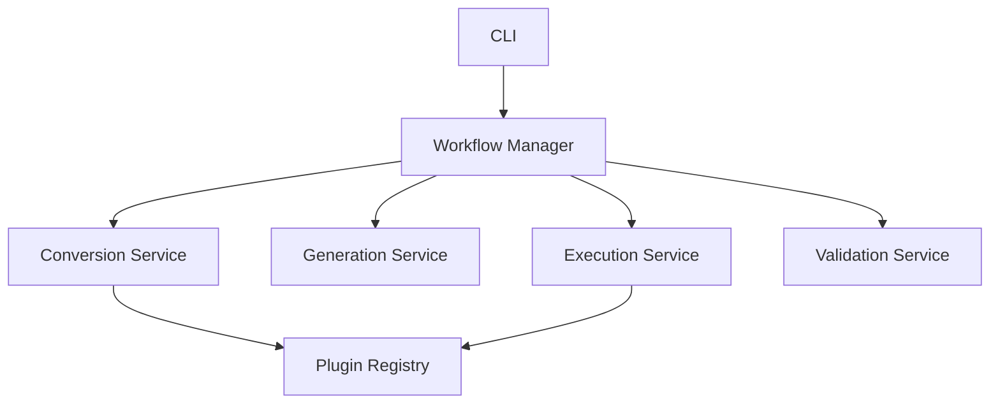

# Design Specification: SQLTraceBench V2

## 1. Introduction

SQLTraceBench V2 is a tool for regenerating high-fidelity database workloads from production traces.

## 2. Architecture

### 2.1 High-Level Architecture

### 2.2 Supported Databases

| Source Database | Target: ClickHouse | Target: StarRocks |
|:----------------|:-------------------|:------------------|
| **MySQL**       | ✅ (Full)          | ✅ (Full)         |
| **PostgreSQL**  | ✅ (Beta)          | ✅ (Beta)         |
| **TiDB**        | ✅ (Full)          | ✅ (Full)         |

## 6. Implementation Roadmap

### Phase 1: Foundation (Current)
- [x] Implement Orchestrator (WorkflowManager)
- [x] Core Services (Conversion, Generation, Execution, Validation)
- [x] Plugin System
- [x] CLI `workflow` command

### Phase 2: Schema Conversion Enhancement
- [x] Schema Converter Factory & Interfaces
- [x] MySQL Converter
- [x] PostgreSQL Converter
- [x] TiDB Converter
- [x] Unified Type Mapping

### Phase 3: Advanced Features
- [ ] Distributed Execution
- [ ] Advanced Parameter Modeling (LSTM, etc)
